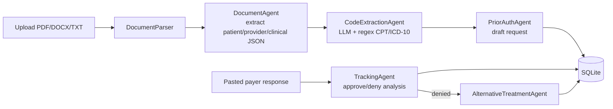

# Prior Authorization Automation

A Streamlit application that automates healthcare prior-authorization paperwork: it parses medical documents, extracts CPT and ICD-10 codes with an LLM plus regex validation, drafts submission-ready prior-authorization requests, tracks payer responses, and prepares appeals and alternative-treatment suggestions for denials.

Built for provider-side back-office staff who today read doctor's notes by hand, look up codes, and assemble prior-auth packets. The system replaces that manual pipeline with a batch workflow: upload N documents, get N drafted requests persisted to a local SQLite database, then paste payer responses back in to drive status tracking and appeals.

This is a demonstration/prototype system. It ships with synthetic sample documents (fictional patients) and has no payer integration — submission and responses are manual copy/paste. See [docs/HARDENING.md](docs/HARDENING.md) for what would be required before touching real patient data.

## Architecture at a glance

- **Orchestration pattern:** deterministic **sequential pipeline** coordinated in code (`core/batch_processor.py`), not an autonomous agent loop. Five specialized LLM steps — document analysis, code extraction, request preparation, response tracking, alternative suggestions — are each implemented as a class wrapping a single OpenAI chat-completion call with a structured-JSON response format. The pipeline order is fixed; a conditional branch runs the tracking and alternatives steps only when a payer response is processed and comes back denied. There is no tool calling, no inter-agent handoff, and no parallelism — files are processed one at a time within user-sized batches.
- **Model/framework:** OpenAI Python SDK (`openai>=1.12.0`, Chat Completions API with `response_format={"type": "json_object"}`); model configurable via `OPENAI_MODEL`, default `gpt-4o`; temperatures 0.1–0.3.
- **State:** Streamlit `session_state` for UI state; SQLite (`prior_auths`, `batches` tables) for persistence. Each LLM call is stateless and single-turn — full intermediate JSON is stored in the database `notes` column and re-supplied as context to later steps (response analysis, appeals).
- **Retrieval:** none. No vector store, no RAG; each step sees only the parsed document text and prior-step JSON.



## Quickstart

```bash
git clone https://github.com/git-bonda108/agentic-healthcare-prior-auth.git
cd agentic-healthcare-prior-auth
pip install -r requirements.txt
python setup.py          # creates ./data and a .env template
```

Expected output from `python setup.py`:

```
✅ Created .env file. Please add your OPENAI_API_KEY.
✅ Project setup complete!
```

Edit `.env` and replace `your_openai_api_key_here` with your OpenAI API key, then:

```bash
python test_system.py    # offline smoke test: imports, parsing, regex extraction, DB
python -m streamlit run app.py
```

The app opens at `http://localhost:8501`. Try it end to end by uploading the files in `sample_data/` (seven synthetic doctor's notes with known CPT/ICD-10 codes) on the "Upload & Process" page. A dev container (`.devcontainer/`) is included for GitHub Codespaces; it installs dependencies and starts Streamlit on port 8501 automatically.

## Configuration

All configuration is read from environment variables (or `.env`) by `utils/config.py`.

| Variable | Required | Default | Purpose |
|---|---|---|---|
| `OPENAI_API_KEY` | yes | — | OpenAI API key; the app refuses to start without it. Get one at https://platform.openai.com/api-keys |
| `OPENAI_MODEL` | no | `gpt-4o` | Chat model used by all five LLM steps |
| `BATCH_SIZE` | no | `5` | Default files per batch (adjustable 1–20 in the UI sidebar) |
| `DATABASE_PATH` | no | `./data/prior_auths.db` | SQLite database location |

`utils/config.py` also declares `MAX_RETRIES`, `TIMEOUT_SECONDS`, `MAX_FILE_SIZE_MB`, and `ALLOWED_EXTENSIONS`, but these constants are not currently wired into the processing code — see [docs/EVALUATION.md](docs/EVALUATION.md).

## Repository map

```
app.py                  Streamlit UI: upload/process, records view, status tracking, appeals
agents/                 One class per LLM step (document, codes, prior auth, tracking, alternatives)
core/batch_processor.py Pipeline orchestrator: batching, per-file workflow, denial branch
core/document_parser.py PDF/DOCX/TXT text extraction (PyPDF2, python-docx)
core/database.py        SQLite schema and CRUD (prior_auths, batches)
utils/config.py         Env-based configuration and validation
utils/validators.py     Regex CPT/ICD-10 extraction and format validation
sample_data/            Seven synthetic doctor's notes with documented expected codes
test_system.py          Offline component smoke test (no API key needed)
test_agents.py          Live end-to-end agent test (calls the OpenAI API)
```

## Documentation

- [docs/ARCHITECTURE.md](docs/ARCHITECTURE.md) — component map, data flow, orchestration and state analysis, design trade-offs
- [docs/EVALUATION.md](docs/EVALUATION.md) — what tests exist, edge cases the code handles, and a proposed evaluation harness
- [docs/HARDENING.md](docs/HARDENING.md) — current security posture, PHI/compliance status, and a staged path to production
